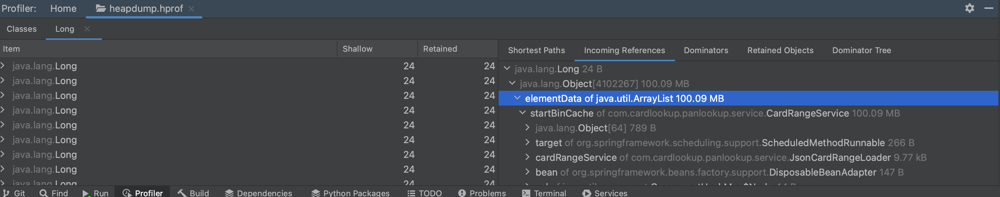

# panlookup

## Overview

**panlookup** is a high-performance Spring Boot application for managing and querying large sets of card range (BIN range) data. It provides tools for generating test data, loading card ranges from files or a database, and performing fast lookups using either in-memory caching or direct database access.

## Features

- **Card Range JSON Generator** - Generate large datasets of card ranges in JSON format for testing and bulk processing.
- **Configurable Startup Loader** - Optionally load card range data from a JSON file at application startup.
- **Database Integration** - Persist card range data using PostgreSQL with Spring Data JPA.
- **In-Memory Caching** - Store a sorted List<Long> of start-bins and use binary search for efficient range-based lookups. This cache can be toggled via configuration.
- **Redis Range Cache** - Cache each card range in its own Redis HASH (cardrange:<startBin>). Lookups first consult Redis; on a miss the service falls back to the database and then populates Redis.

## Requirements

- Java 17 or higher
- Gradle
- PostgreSQL
- Redis (optional, for caching)
- A `data/` directory in the project root to store generated JSON files

## Configuration

Application settings in `application.yml`:

```yaml
cardrange:
  load-on-startup: false  # Load card range data from file at startup
  cache-enabled: true     # Enable in-memory caching for lookups
```

## Performance

Performance metrics from `CardRangeLoaderPerformanceTest` on MacBook Air M1:

- Lookup over 2.8 million card ranges averages around 4.04 ms using direct database access, which is sufficient for most use cases.
- ~100 MB memory usage with List startRange cache (2,800,000 ranges)
  


## Setup

1. Clone repository:
```bash
git clone https://github.com/your-org/panlookup.git
cd panlookup
```

2. Start PostgreSQL & Redis:
```bash
docker compose up -d
```

3. Create data directory:
```bash
mkdir -p data
```
4. Generate sample data:
```bash
./gradlew run -PmainClass=com.cardlookup.panlookup.tool.CardRangeJsonGenerator
```
This will create a sample JSON file in the `data/` directory, or you can manually copy `pres.json.data` into `data/`.

## Build and Run

Build with Gradle:
```bash
./gradlew clean build
```

Run application:
```bash
./gradlew bootRun
```

## Test

To test the API endpoint:

1. Start the application:
```bash
./gradlew bootRun
```

2. Open your browser and navigate to:
```
http://localhost:8080/api/card-range/4000024329999999
```
Replace `4000024329999999` with any 16-digit PAN you want to look up. This will return the card range information for the given PAN.

Example PANs for testing:
- 4000024329999999
- 5200000000000000
